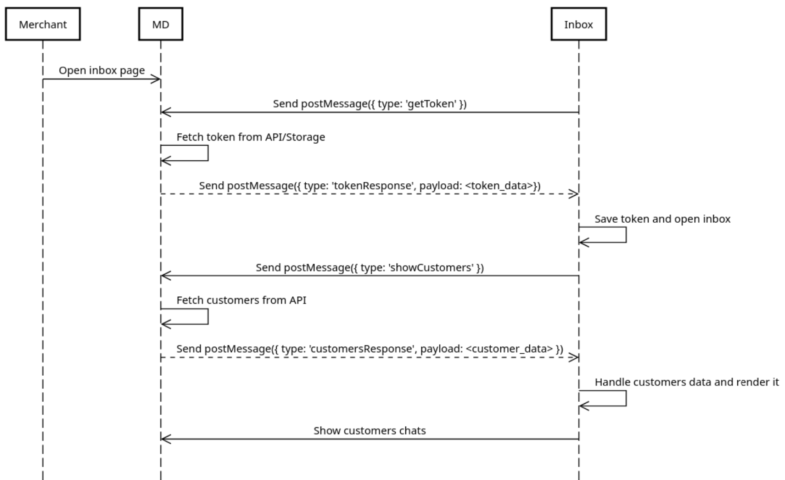

# MD and Inbox Applications

## Overview

This project consists of two React applications: **MD (Main Dashboard)** and **Inbox**. The applications communicate with each other using the `postMessage` API, allowing the Inbox to request a token and customer data from the MD. This setup demonstrates cross-origin communication and asynchronous message handling between two web applications.

## Applications

### 1. MD (Main Dashboard)

- **Purpose**: Acts as the main application that handles requests from the Inbox for authentication and customer data.
- **Key Features**:
  - Listens for messages from the Inbox.
  - Handles requests for tokens and customer data.
  - Sends responses back to the Inbox with the requested information.

### 2. Inbox

- **Purpose**: A secondary application that interacts with the MD to obtain necessary data.
- **Key Features**:
  - Sends requests to the MD for a token and customer data.
  - Displays the received data to the user.
  - Handles loading states and error messages.

## Logic Flow


### Communication Flow

1. **Request for Token**:
   - The Inbox sends a message to the MD requesting a token using `postMessage`.
   - The message includes a unique identifier to match the response later.

2. **MD Processes the Request**:
   - The MD receives the message and processes the request to fetch the token from an external API (e.g., `https://reqres.in/api/login`).

3. **MD Sends Token Response**:
   - After fetching the token, the MD sends a response back to the Inbox using `postMessage`, including the token data and the original unique identifier.

4. **Request for Customer Data**:
   - The Inbox sends another message to the MD requesting customer data, again including a unique identifier.

5. **MD Processes the Customer Request**:
   - The MD receives the message and fetches the customer data from an external API (e.g., `https://reqres.in/api/users?page=2`).

6. **MD Sends Customer Data Response**:
   - After fetching the customer data, the MD sends a response back to the Inbox with the customer data and the original unique identifier.

### Security Considerations

- **Origin Validation**: Both applications validate the origin of incoming messages to ensure that they only accept messages from trusted sources.
- **Controlled Environment**: The Inbox is designed to operate exclusively within the MD context, ensuring that it cannot be used independently. This design enhances security by requiring the MD for essential operations.

## Getting Started

### Prerequisites

- Node.js and npm installed on your machine.

### Installation

1. Clone the repository:
   ```bash
   git clone <repository-url>
   cd postmessage_poc
   ```


2. Navigate to the MD directory and install dependencies:
   ```bash
   cd md
   npm install
   ```

3. Navigate to the Inbox directory and install dependencies::
   ```bash
   cd inbox
   npm install
   ```

### Running the Applications

1. Start the MD application:
   ```bash
   cd md
   npm start
   ```
2. Start the MD application: (will prompt that the port used type y to use another port)
   ```bash
   cd inbox
   npm start
   ```

3. Open your browser and navigate to http://localhost:3000 to view the MD application, which will load the Inbox in an iframe.

### Conclusion

This project demonstrates how to implement inter-application communication using the postMessage API in a secure and efficient manner. The MD and Inbox applications work together to provide a seamless user experience while maintaining a decoupled architecture.